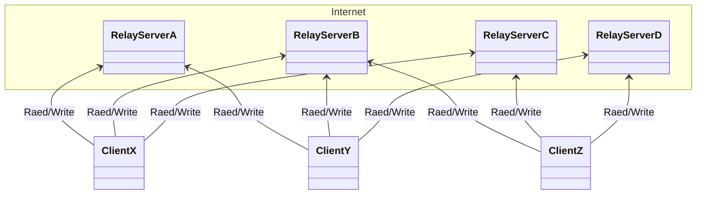
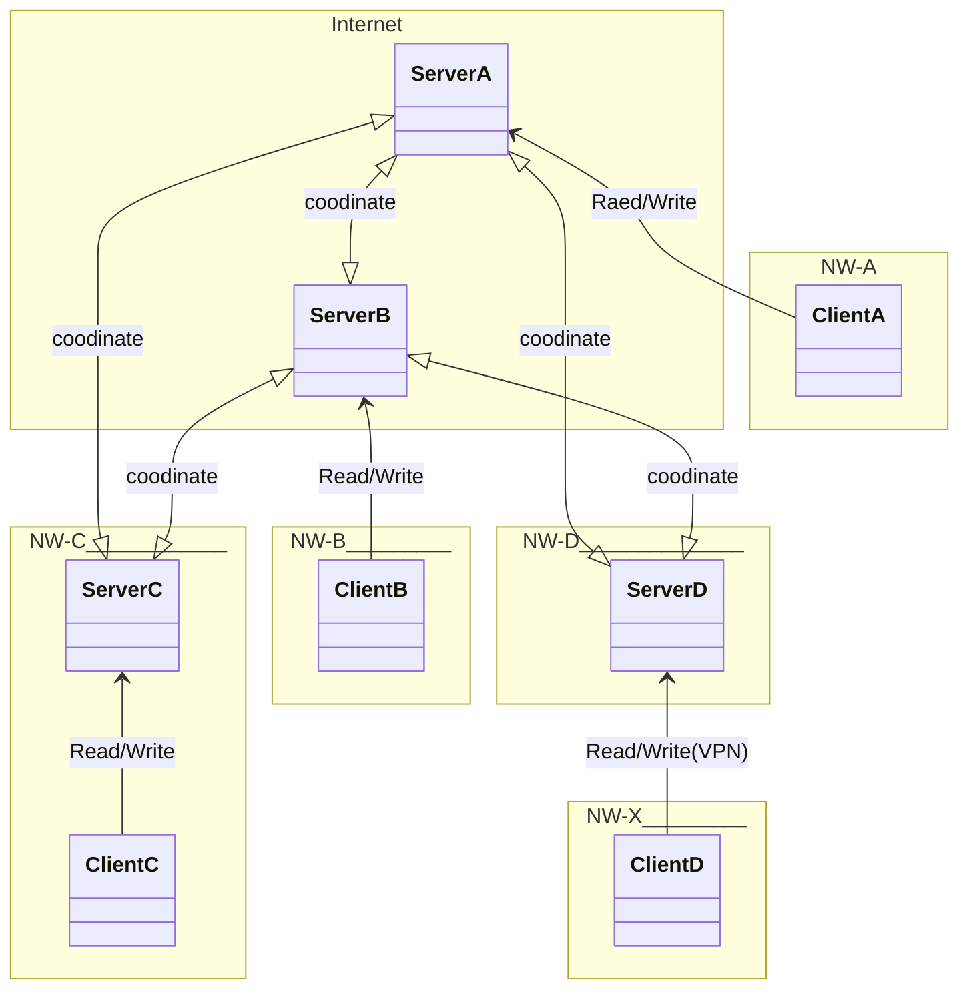

- [What is NostrP2P?](#what-is-nostrp2p)
- [Consept and Design](#concept-and-design)
- [Technical Overview](#technical-overview)
  - [Difference and Commpon Points with (General) Nostr](#difference-and-commpon-points-with-general-nostr)
  - [(General) Nostr Architecture](#general-nostr-architecture)
  - [NostrP2P Architecture](#nostrp2p-architecture)
- [Build](#build)
- [NostrP2P Command Usage](#nostrp2p-command-usage)
- [Specification](#specification)
- [Examples](#examples)
  - [Generate Key Pair](#generate-key-pair)
  - [Server Launch](#server-launch)
- [Bootstrap Server](#bootstrap-server)
- [Client](#client)
- [Trial](#trial)
  - [Current Implemented Featues on Dedicated NW](#current-implemented-featues-on-dedicated-nw)
  - [Current Implemented Features with Nostr Client (Not NostrP2P Client) Using a Protcol Bridge Server](#current-implemented-features-with-nostr-client-not-nostrp2p-client-using-a-protcol-bridge-server)
- [Roadmap (Server\&Client)](#roadmap-serverclient)

# What is NostrP2P?
- Pure Peer-to-Peer Distributed Microblogging System on NAT Transparent Overlay Network Based on Idea of [Nostr](https://en.wikipedia.org/wiki/Nostr)
- Distributed Microblogging System by All User's Contribution
- I wrote an article about NostrP2P :)
  - ["NostrP2P: Pure P2P Distributed Microblogging System - ryo_grid's tech articles"](https://ryogrid.github.io/tech-entry/about-nostrp2p.html)

# Concept and Design
- [here (English)](https://gist.github.com/ryogrid/fa2bfa284784c866ad88e3c38445752a)
  - English version is latest :)
- [Japanese version](https://gist.github.com/ryogrid/0ba0d825c3bb840dffa519c5ab91d4ff)


# Technical Overview
## Difference and Commpon Points with (General) Nostr
- Difference with (general) Nostr
  - Server (Relay server)
    - Firstly, in NostrP2P, servers communicate with each other on pure peer-to-peer manner. Clients does not
      - This means that NostrP2P has client-server architecture also
    - Servers of NostrP2P are correspond and similar to Relay server of Nostr but these are more distributed and coodinate with each other
    - Servers handle each recieved event data in a different way though these are not special kind one (ex: replacable events) on Nostr because optimization for pure peer-to-peer network architecture is needed
    - Supporse large number of servers because each user of NostrP2P need my server
    - Client can trust server it accesses to
      - This is important for optimization of client's network resource consumption and power consumption
    - Powerful machine is not needed for server because it handles only one user's requests and amount of managing data is not large compred to (general) Nostr
      - If we considered server (Relay server) as a kind of database system, above is obvious 
  - Client
    - Almost same role with one of Nostr but its communication protocol between server is little bit different
      - In current plan, transport is REST and data is encoded to binary. Not websocket and Not JSON text
    - Client which is used by User-A only accesses to a server which is managed by the user
  - In all of design
    - Microbrogging application specific
      - This means architecture and protcorl of NostrP2P is not for general purpose unlike Nostr
        - "Nostr" is a name of architecture and protocol and not name of SNS and Microblogging system
      - In other words, "NostrP2P" is a name of an microblogging system like "Bluesky"
- Common point with (general) Nostr
  - Data structure of event data is almost same
  - Key pair format and signing method are same
  - Specification like kind number is same if it is for same functionality (at least for now)
  - Functionality realization led by Clients
    - (flexibility may be low compared with general Nostr...)
  
　　  
## (General) Nostr Architecture


  
## NostrP2P Architecture



# Build
```bash
$ go build -o nostrp2p main.go
```

# NostrP2P Command Usage
```
Usage:
  nostrp2p [flags]
  nostrp2p [command]

Available Commands:
  help        Help about any command.
  server      Startup server.
  genkey      Generate new key pair.

Flags:
  -h, --help   Help for NostrP2P
```

```
Usage:
  nostrp2p server [flags]

Flags:
  -h, --help                         Help for server
  -l, --listen-addr-port    string   Address and port to bind to (default: 127.0.0.1:20000)
  -b, --boot-peer-addr-port string   Address and port of a server which already joined NostrP2P network (optional)
  -p, --public-key          string   Your public key (required)
  -d, --debug               bool     If true, debug log is output to stderr (default: false)
```


# Specification
- [here](/specification/SPECIFICATION.md)


# Examples
## Generate Key Pair
```bash
./nostrp2p genkey
Secret Key:
...
Secret Key (In Hex Representation): 
...
Public Key:
...
Public key (In Hex Representation): 
...
```

## Server Launch
```bash
# 4 servers network on local network (4 shells are needed...)
./nostrp2p server  -l 0.0.0.0:20000 -p <public key in npub format>
./nostrp2p server -l 0.0.0.0:20002 -p <public key in npub format> -b 127.0.0.1:20000
./nostrp2p server -l 0.0.0.0:20004 -p <public key in npub format> -b 127.0.0.1:20002
./nostrp2p server -l 0.0.0.0:20006 -p <public key in npub format> -b 127.0.0.1:20000
```

```bash
# 4 servers distributed on different networks

# on network ryogrid.net (bind to address/port which is accessible from The Internet)
./nostrp2p server  -l 0.0.0.0:20000 -p <public key in npub format>

# on network redsky.social (bind to address/port which accessible from The Internet)
./nostrp2p server -l 0.0.0.0:7777 -p <public key in npub format> -b ryogrid.net:9999

# on network A (bind to address/port which is NOT accessible from The Internet)
./nostrp2p server -l 0.0.0.0:20000 -p <public key in npub format> -b ryogrid.net:8888

# on network B (bind to address/port which is NOT accessible from The Internet)
./nostrp2p server -l 0.0.0.0:20000 -p <public key in npub format> -b redsky.social:7777
```

# Bootstrap Server
- Currently, running server which is accessible from The Internet is below
  - ryogrid.net:8888
    - this address including port number shoud be specified at launching of your server with -b option
- **These servers don't response to write kind REST API requests from clients. A server for yourself is also needed to use NostrP2P!** 

# Client
- [here](https://github.com/ryogrid/flustr-for-nosp2p)


# Trial
## Current Implemented Featues on Dedicated NW
- Please refer [this article's Demo section :)](https://ryogrid.github.io/tech-entry/about-nostrp2p.html)

## <del>Current Implemented Features with Nostr Client (Not NostrP2P Client) Using a Protcol Bridge Server</del>
- <del>Please read [this](https://gist.github.com/ryogrid/5080ff36b6786902d40bb4b91de0766e#file-nostrp2p_demo_v3_procedure-md)</del>

# Roadmap (Server&Client)
- [x] Messaging on NAT Transparent Overlay Network
- [x] Posting with Client
- [x] Reaction
- [x] Following
- [x] Mention
- [x] Reply
- [x] Quote Repost
- [x] Repost
- [x] Server Side Signature Validation
- [x] Restriction of Memory Usage on Server
- [x] Data persistence on Server with embedded DB
- [ ] Follower Multicast Mode
  - In this mode, posted messages are not broadcasted and server of follower should register to followee's server
  - If broadcasting design reaches limit of scalability, this mode will be activated
- [x] Optimization of Communication Data Amount between Client and Server
  - Changing serialization format from JSON Text to MessagePack
    - Format conversion must be needed both side
  - Activate data compression on HTTP layer (gzip, deflate ... etc) 
- [ ] Developing More Scalable Overlay Transport
  - Overlay NW with Mesh library may not scale over 100 nodes roughly according to a description at [here](https://github.com/weaveworks/mesh?tab=readme-ov-file#mesh--)   
